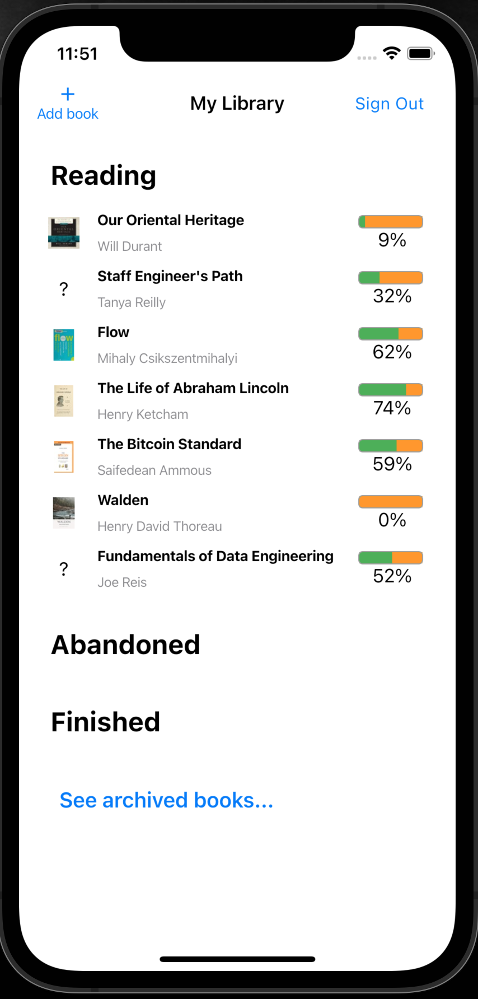
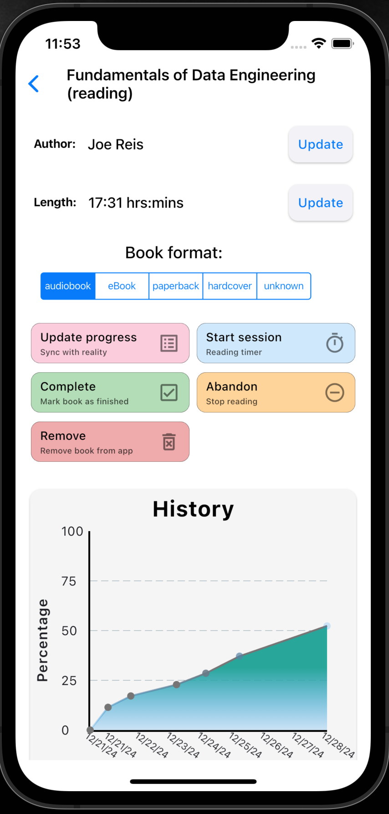

## What is this

An iOS app for tracking progress on reading books.

Motivation: using Goodreads for tracking books in progress is a cool idea, but the user experience
they've implemented is too cumbersome, and unlikely to ever improve. And new tokens for the
Goodreads API are not available anymore, so it can't be plugged-into directly. Other reading apps
on the App Store are often very childish/gamified, and often focused on social aspects than 
tracking reading progress specifically.

### Screenshots

#### Homescreen

#### Book progress

## Development notes

During development, it may be important to get the generators going via
`dart run build_runner watch` as recommended on the riverpod

- [Cookbook: Useful Flutter samples](https://docs.flutter.dev/cookbook)
